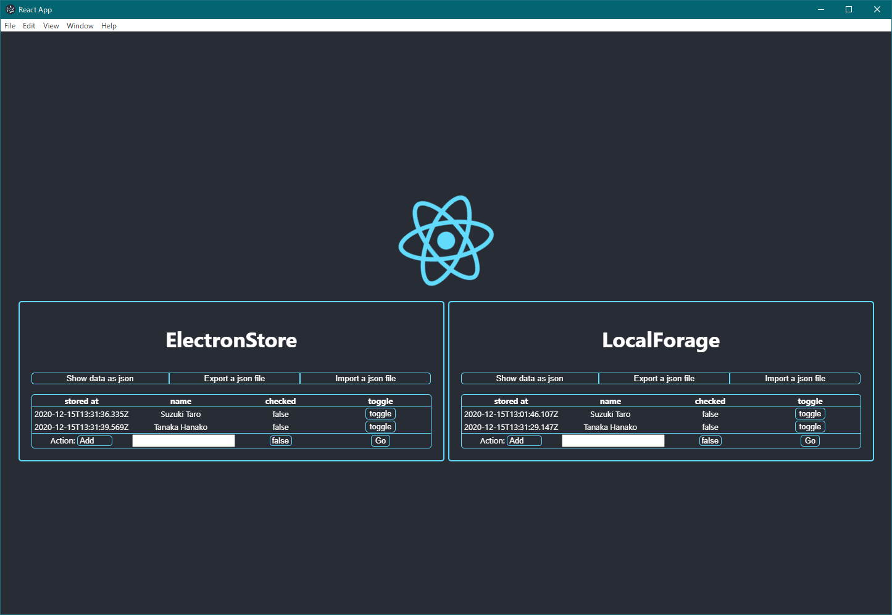

# Demo

Use these packages

- [srymh/user\-data\-store](https://github.com/srymh/user-data-store)
- [srymh/cra\-template\-typescript\-electron](https://github.com/srymh/cra-template-typescript-electron)




```
npx create-react-app my-app --template git+https://github.com/srymh/cra-template-typescript-electron.git
cd my-app
yarn add git+https://github.com/srymh/user-data-store#v0.1.5
yarn add localforage electron-store@5.2.0

# Edit your code...

npm run electron:dev
```
